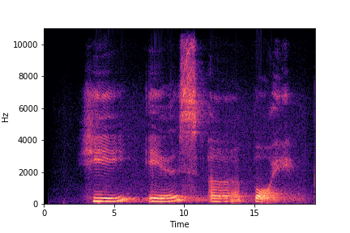
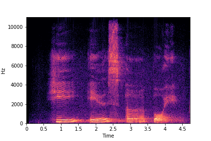
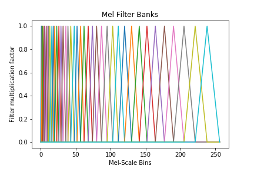

# Vanilla STFT and MFCC

This repository contains a Python implementation of Short-time Fourier transform (STFT) and Mel-frequency cepstral coefficients (MFCCs) from scratch, along with comparisons with the ```librosa``` implementation.


For further details on the results and analysis, please refer to the report - ```report.pdf``` 

## Installing Dependencies

Make sure you have a Python3+ version. Run the following command - 

```
pip install -r requirements.txt
```

## Running the code

Open jupyter notebook using the following command - 

```
jupyter notebook
```

and select ```notebook.ipynb```. All the step-by-step code and analysis is present here.

## Analysis

### Comparison between Custom and ```librosa``` implementations

The implementations differ slightly in terms of computation time taken to obtain the spectrogram (primarily because of the internal optimisation done by ```librosa```).

On a short 3 second recording, the Spectrogram as obtained from ```librosa``` is as follows - 



The Spectrogram obtained from custom implementation is as follows - 



### Visualisation of Mel Filter Banks

A primary reason to switch to a Cepstral scale is to map audio frequencies in a scale which represents the way humans perceive sound. 

The Mel Filter banks look like this - 




## License 

Copyright (c) 2020 Brihi Joshi

For license information, see [LICENSE](LICENSE) or http://mit-license.org


- - -

This code was written as a part of a course assignment in **Speech Recognition and Understand** with [Dr. Pravesh Biyani](https://www.iiitd.ac.in/praveshb) at IIIT Delhi during Winter 2020 Semester. 

For bugs in the code, please write to: brihi16142 [at] iiitd [dot] ac [dot] in

